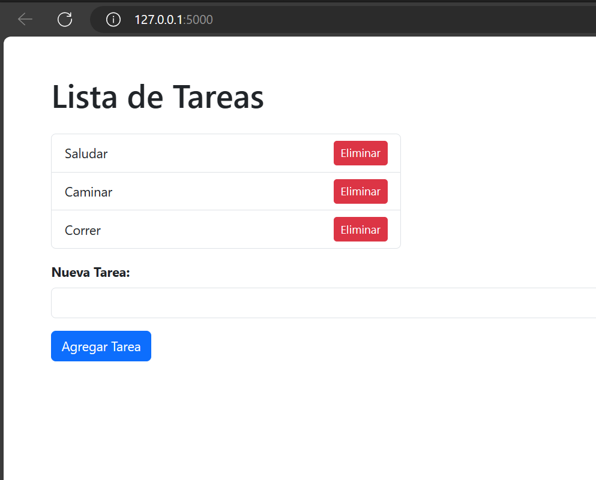
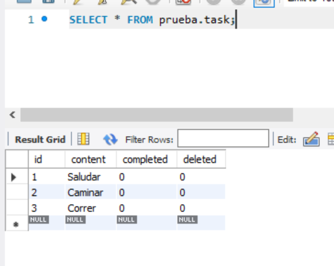
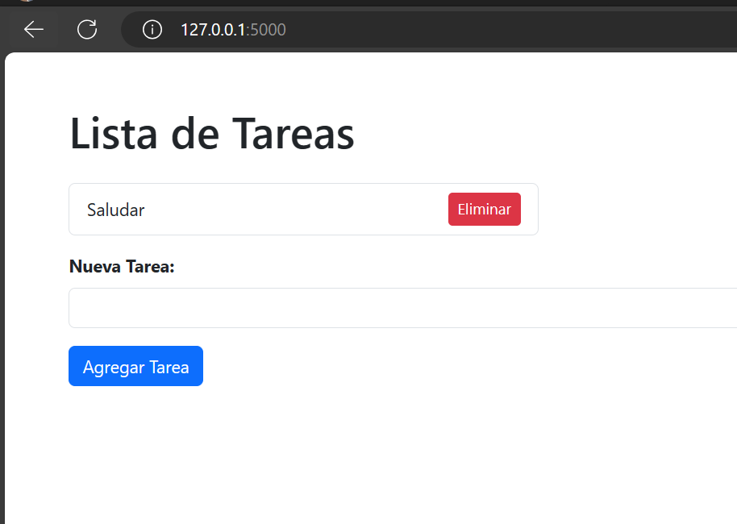
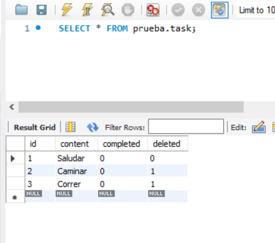
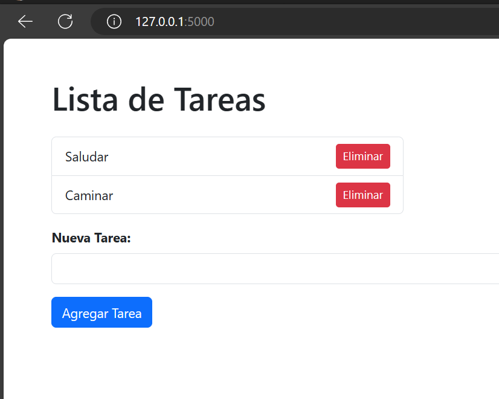

# Aplicación Flask con MySQL y Docker (Soft-Delete)

## Implementación de SoftDelete

En esta aplicación, la funcionalidad de SoftDelete se logra introduciendo una columna `deleted` en el modelo de la base de datos. Cuando un registro se marca como eliminado, se elimina lógicamente de los registros activos mientras se conserva su existencia en la base de datos.

La funcionalidad de SoftDelete se aplica al modelo `Task`, y la aplicación proporciona rutas para ver, agregar y eliminar lógicamente tareas.

### **Seleccionar Idioma:**
- [Español](README.md)
- [Inglés](README-en.md)

## Resultado
### Inicio
 
### Base de Datos
 
### Eliminación Lógica
 
### Soft-Delete (DB)
 
### Agregar
 
### Agregar con Soft-Delete
 

## Prerrequisitos

- [Python](https://www.python.org/downloads/)
- [Docker](https://www.docker.com/get-started)

## Comenzar

1. Clona el repositorio:

    ```bash
    git clone https://github.com/Anyel-ec/Flask-MySQL-Docker-SoftDelete
    cd Flask-MySQL-Docker-SoftDelete
    ```

2. Ejecuta la aplicación Flask localmente:

    ```bash
    # Instala las dependencias
    pip install -r requirements.txt

    # Ejecuta la aplicación Flask
    python app.py
    ```

   La aplicación estará disponible en [http://localhost:5000](http://localhost:5000).

3. Dockeriza la aplicación:

    ```bash
    # Construye la imagen Docker
    docker build -t my-flask-app .
    
    # Ejecuta el contenedor Docker
    docker run -p 5000:5000 my-flask-app
    ```

   La aplicación en Docker estará disponible en [http://localhost:5000](http://localhost:5000).


## Configuración de Docker

Se proporcionan los archivos Dockerfile para la contenerización.

- **Dockerfile:**
  - Usa la imagen oficial de Python 3.8 como base.
  - Configura el directorio de trabajo en `/app`.
  - Copia los archivos necesarios al contenedor.
  - Instala las dependencias desde requirements.txt.
  - Expone el puerto 5000.
  - Define el comando para ejecutar la aplicación Flask.

- **docker-compose.yml:**
  - Define dos servicios: `flask-app` y `mysql-db`.
  - `flask-app` se construye desde el directorio actual y depende de `mysql-db`.
  - `mysql-db` utiliza la imagen oficial de MySQL, expone el puerto 3306 y establece variables de entorno para la configuración.

## Notas

- La aplicación Flask utiliza SQLAlchemy con el controlador `pymysql` para conectarse a la base de datos MySQL.

- Personaliza las configuraciones en `app.py`, `Dockerfile` y `docker-compose.yml` según sea necesario para tu proyecto.

- Este es un ejemplo básico y es posible que debas ajustar las configuraciones según tus requisitos específicos.